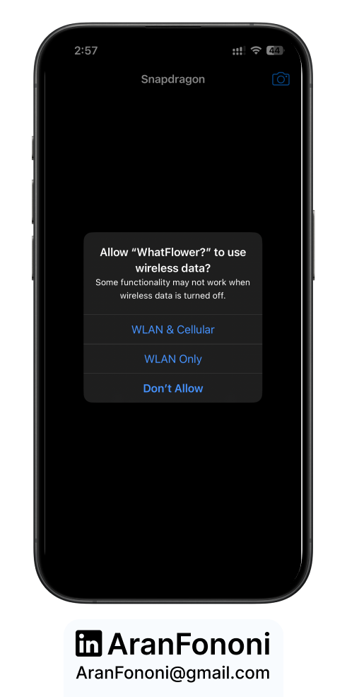
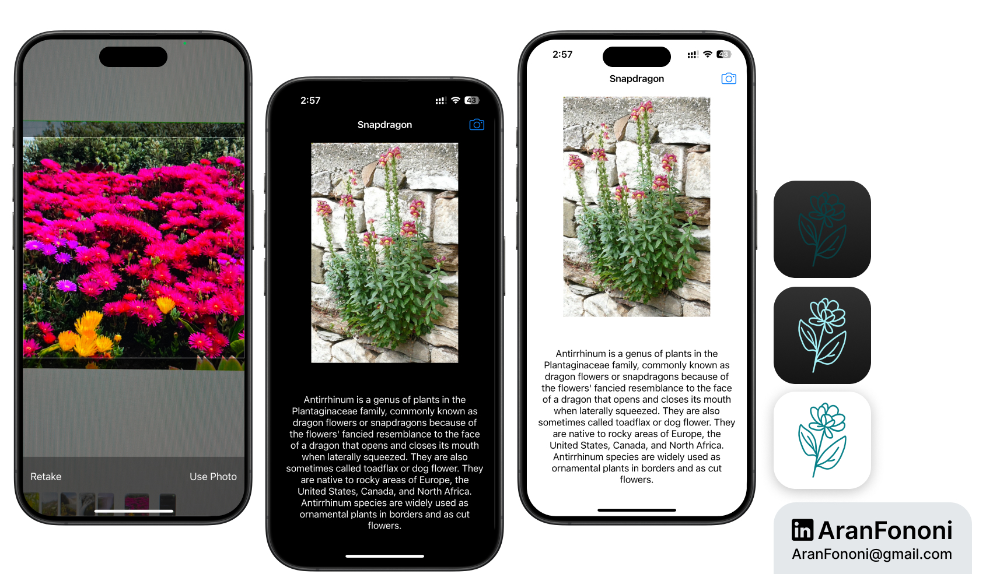

# Plant Scanner App 🌱

### Project for Section 24: **AI Plant Identification Using Core ML**

This app is a plant identifier that scans and recognizes different plant species, then fetches relevant information from Wikipedia. This project leverages Core ML for image classification and integrates third-party libraries like **Alamofire** and **SwiftyJSON** for network requests, as well as **SDWebImage** for image handling.

## Project Overview
The **Plant Scanner App** allows users to identify plants using a Core ML model. Users can capture plant images directly within the app, which then runs a Vision request to classify the image. Based on the classification, the app retrieves information from Wikipedia to give users more details about the plant.

## What I Learned
Through building this app, I enhanced my understanding of:
- **Core ML and Vision for Image Classification**: Used a custom Core ML model to classify plants and integrated it with Vision for image handling.
- **Network Requests with Alamofire and JSON Parsing**: Employed Alamofire to make HTTP requests to the Wikipedia API and used SwiftyJSON for parsing JSON responses.
- **Dynamic Image Loading**: Displayed images with SDWebImage, handling asynchronous image downloads and caching.

## Key Skills
- Core ML model conversion and Vision request integration
- Networking with Alamofire and JSON parsing with SwiftyJSON
- Working with UIImagePicker for camera-based image capture

## Additional Features
- **Wikipedia Integration**: Fetches detailed descriptions and a high-resolution image of the identified plant species from Wikipedia.
- **Real-time Image Recognition**: Provides a fast and interactive way for users to learn about plants directly from their camera.
- **Camera Functionality**: Allows users to capture images directly through the app, improving usability in outdoor settings.

---

### Project Preview

---

### Footer

---

## Contact
For more information, feel free to reach out:  
- **Email**: [aranfononi@gmail.com](mailto:aranfononi@gmail.com)  
- **LinkedIn**: [Aran Fononi](https://www.linkedin.com/in/aran-fononi-18182b265)
